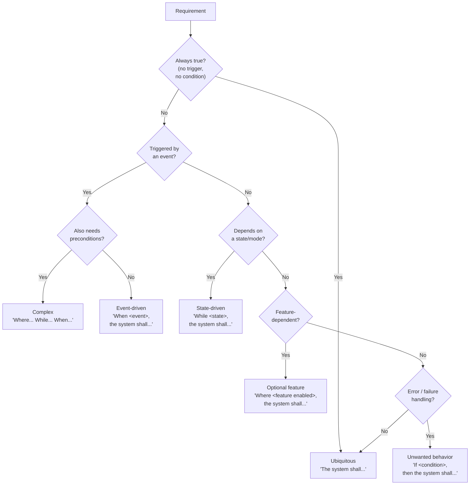

## What I do

Guide the writing, review, and translation of requirements using the EARS (Easy Approach to Requirements Syntax) methodology.

## Reference Material

The canonical EARS patterns, templates, examples, and checklists are in `references/ears-reference.adoc`. Consult it for sentence type definitions, templates, and troubleshooting. The content below provides operational guidance for applying the methodology — it does not duplicate the reference.

## How to Apply EARS

Follow these steps when writing or translating requirements:

1. **Identify** whether you are working with a requirement, or something else (e.g. a note, example, or design decision). Only requirements get EARS treatment.
2. **Identify compound requirements** -- determine whether the requirement needs to be split into multiple atomic requirements.
3. **Identify the acting system, person, or process.**
4. **Analyse the needed sentence type(s)** -- select from Ubiquitous, Event-driven, State-driven, Unwanted behavior, or Optional feature. Use Complex (combined) when you need both preconditions (Where/While) and a trigger (When), including within If-then statements for unwanted behavior. When combining keywords, use this order: **Where** ... **While** ... **When** ... / **If** ... **then** ...
5. **Identify possible missing requirements** -- e.g. 2 states and 2 events usually produce 4 requirements. Check all combinations.
6. **Analyse the translated requirements** for ambiguity, conflict, and repetition.
7. **Review requirements** if possible. Iterate as required.

## Checking for Completeness

After writing requirements, use the following techniques to find gaps.

### Truth Tables

When a system function operates across multiple states or modes, build a truth table listing every combination. Each cell represents a potential requirement. Missing cells often reveal missing requirements.

### Function-Level Review

For each identified system function, ask:

1. Is there a requirement for normal operation? (Typically ubiquitous.)
2. Does the function have accuracy, timing, or sequencing constraints?
3. Under what conditions does it activate? (Event-driven or state-driven.)
4. Are there availability or reliability requirements?
5. What should happen on failure or invalid input? (Unwanted behavior.)

### Requirement Pairing

Requirements often come in natural pairs. When you write one side, check the counterpart:

- **Wanted / Unwanted:** Normal behavior paired with error handling.
- **Primary / Backup:** Main operating mode paired with fallback mode.
- **Enable / Disable:** Activating a feature paired with deactivating it.
- **Start / Stop:** Initiating a process paired with terminating it.

### Traceability Through Structure

Each clause in a combined EARS requirement (Where, While, When) implies a sub-function that may need its own lower-level requirement. Use the structure of combined requirements as a traceability aid.

## Choosing a Pattern

- Always true -> Ubiquitous
- Triggered by an event -> Event-driven
- Depends on a state/mode -> State-driven
- Depends on a feature -> Optional feature
- Error/invalid/failure handling -> Unwanted behavior
- Needs both preconditions and a trigger -> Complex

### Ubiquitous vs. Event-Driven

When a behavior could be either ubiquitous or event-driven, consider the system's criticality and operational context. A monitoring system that must always show the latest value needs ubiquitous (continuous). A notification system that only acts on change needs event-driven. If unclear, ask the stakeholder.

### Passive vs. Active Response

Some requirements demand tolerance without active response (passive), others require detection and action (active):

- **Passive:** The system shall be immune to `<condition>`.
- **Active:** When `<condition is detected>`, the system shall `<response>`.

## Characteristics of a Good Requirement

Every requirement you write or review must satisfy all of these:

| Characteristic | Description |
|---|---|
| **Unambiguous** | Has only one interpretation |
| **Traceable** | Has a unique identifier |
| **Consistent** | Does not conflict with other requirements |
| **Verifiable** | It is possible to check that the system meets the requirement |
| **Complete** | Not lacking relevant information |
| **Atomic** | Expresses a single behavior; not a compound statement |
| **Implementation-free** | States *what* the system does, not *how* it is built |
| **Concise** | Uses no more words than necessary to convey the meaning |
| **Non-duplicated** | Does not restate the same intent as another requirement |

## Attribution

EARS was originally described in:

- Mavin, A., Wilkinson, P., Harwood, A., and Novak, M., "Easy Approach to Requirements Syntax (EARS)", Proceedings of the 17th IEEE International Requirements Engineering Conference (RE), 2009. Link: https://ieeexplore.ieee.org/document/5328509

The completeness techniques, lessons on requirement pairing, passive/active distinctions, and additional troubleshooting guidance are informed by the follow-up study:

- Mavin, A. and Wilkinson, P., "Big EARS (The Return of Easy Approach to Requirements Syntax)", Proceedings of the 18th IEEE International Requirements Engineering Conference (RE), 2010.

The templates, methodology, and guidance in this skill are derived from these works. All content is written in the authors' own words for this skill; no verbatim text from the papers is reproduced.
