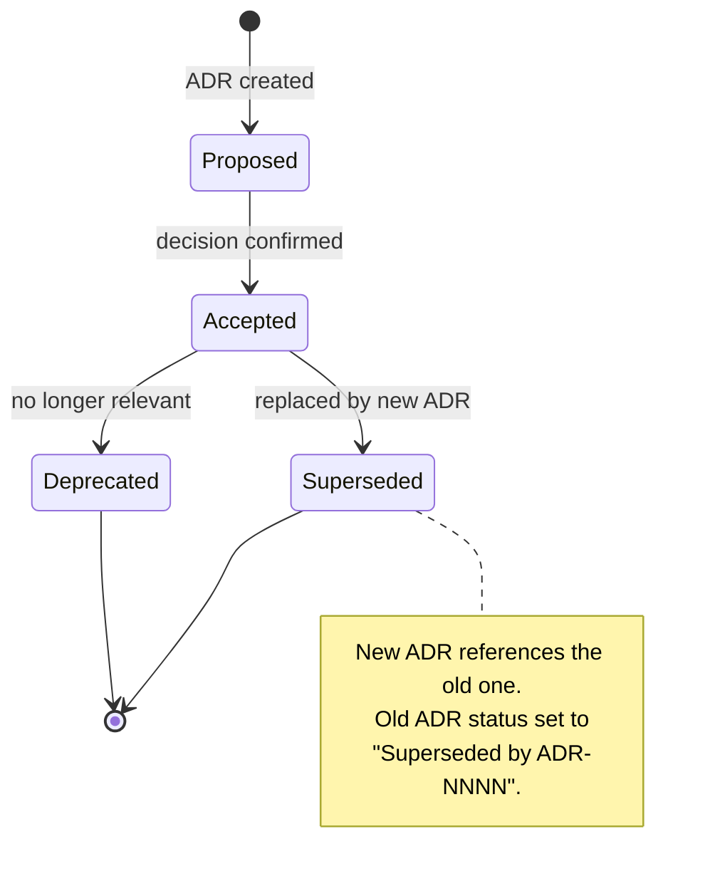

## Prerequisites

This skill is invoked by the `proven-intent` orchestrator or by the `needs-design` capability when technology decisions are identified during the design process.

## Observe

Assess the current state of architecture decisions.

### 1. Read existing ADRs

Look for `docs/adrs/` and `docs/adrs/index.adoc`.

**If the directory exists:** Read `index.adoc` to understand existing decisions. Extract:
- All ADR numbers, titles, statuses, and dates
- The next available sequence number

**If no directory exists:** Note that no ADRs exist. Next number is `0001`.

### 2. Read constraints

Read `constraints.adoc` from the project root. Identify constraints that may be relevant to the decision (architecture constraints, licensing constraints for technology choices).

### 3. Report observation

Return to the orchestrator:
```
ADRs: {exists: true/false, count: N, accepted: N, deprecated: N, superseded: N, next-number: "NNNN"}
```

## Evaluate

Given the desired state (a technology decision that needs recording), determine what action is needed.

### 1. Is this decision already recorded?

- Search existing ADRs for decisions covering the same topic
- If an accepted ADR already covers this decision → no action needed (report to orchestrator)
- If an accepted ADR exists but the decision has changed → supersession needed
- If no ADR covers this topic → new ADR needed

### 2. Check constraints

- Would the proposed technology decision violate any constraint? (e.g., licensing constraint for a dependency choice)
- Flag constraint conflicts to the orchestrator

### 3. Report evaluation

Return to the orchestrator:
```
Action: create / supersede / none
Existing related ADR: ADR-NNNN (if applicable)
Constraint conflicts: [list or none]
```

## Execute

### Creating a new ADR

#### 1. Gather decision context

For each decision, identify:
- **Context** -- what is the issue motivating this decision?
- **Decision** -- what is the chosen approach?
- **Consequences** -- what becomes easier or harder?
- **Alternatives considered** -- what other options were evaluated and why rejected?

**When invoked by the orchestrator standalone:** Ask the user for this information.
**When invoked from `needs-design`:** The design capability provides the context and asks the user to confirm.

#### 2. Write the ADR file

Create `docs/adrs/NNNN-<kebab-case-title>.adoc`:

```asciidoc
= ADR-NNNN: <Decision Title>
:status: Accepted
:date: YYYY-MM-DD
:deciders: <who was involved>

== Context

<What is the issue motivating this decision?>

== Decision

<What is the change that is being made?>

== Consequences

<What becomes easier or harder because of this change?>

== Alternatives Considered

=== <Alternative 1>
<Description and reason for rejection>

=== <Alternative 2>
<Description and reason for rejection>
```

**Status values:**
- `Proposed` -- decision not yet confirmed
- `Accepted` -- decision is in effect
- `Deprecated` -- decision is no longer relevant
- `Superseded by ADR-NNNN` -- replaced by a newer decision



**Numbering:** Always use 4-digit zero-padded sequence numbers (`0001`, `0002`, ...).

**File naming:** `NNNN-kebab-case-title.adoc` (e.g., `0001-use-typescript.adoc`).

#### 3. Update the index

Create or update `docs/adrs/index.adoc`:

```asciidoc
= Architecture Decision Records
:version: 1.0.0
:last-updated: YYYY-MM-DD
:toc:

[cols="1,3,1,1", options="header"]
|===
| ADR | Decision | Status | Date

| <<0001-use-typescript.adoc#,ADR-0001>>
| Use TypeScript for backend
| Accepted
| 2026-02-20

| <<0002-use-postgresql.adoc#,ADR-0002>>
| Use PostgreSQL for persistence
| Accepted
| 2026-02-20
|===
```

**Index version rules:**
- `:version:` uses SemVer, starts at `1.0.0`
- MINOR bump when ADRs are added
- PATCH bump for metadata-only changes (status updates, date corrections)
- MAJOR bumps do not apply since ADRs are never removed
- Always update `:last-updated:` to today's date

### Superseding an existing ADR

When a decision changes:
1. Set the old ADR status to `Superseded by ADR-NNNN`
2. Create a new ADR referencing the old one in its Context section
3. Update the index

### Deprecating an ADR

When a decision becomes irrelevant:
1. Set the ADR status to `Deprecated`
2. Update the index

Never delete ADR files. ADRs are append-only records.

## Reference

See `references/example.adoc` for a complete example showing an ADR index and two ADR files.
