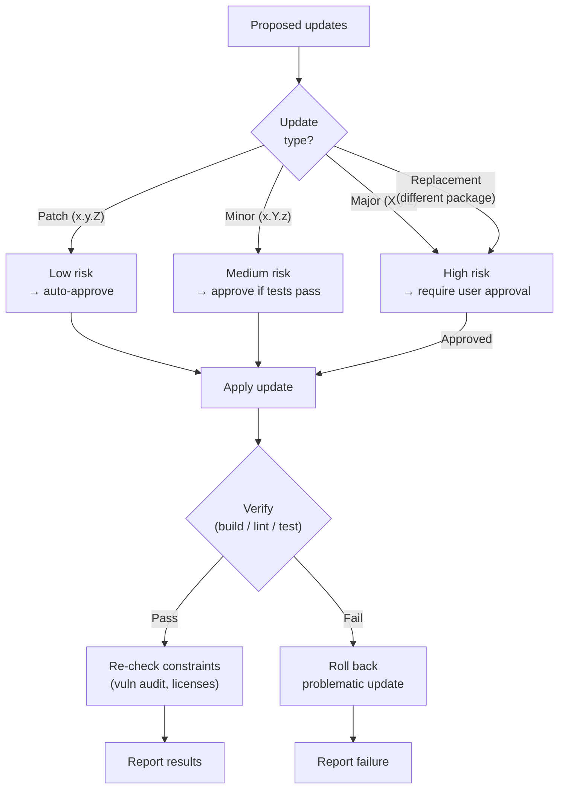

## Prerequisites

This skill is invoked by the `proven-intent` orchestrator, which provides the desired state and current state context.

## Observe

Assess the current state of the project dependency graph.

### 1. Detect package manager

Identify the project's dependency management system:

| File | Package Manager |
|---|---|
| `package.json` + `package-lock.json` | npm |
| `package.json` + `bun.lock` | bun |
| `package.json` + `yarn.lock` | yarn |
| `package.json` + `pnpm-lock.yaml` | pnpm |
| `Cargo.toml` | cargo |
| `go.mod` | go modules |
| `pyproject.toml` / `requirements.txt` | pip / poetry / uv |
| `Gemfile` | bundler |

### 2. Analyze dependency state

For each dependency:
- **Current version** installed
- **Latest version** available
- **Version constraint** in the manifest
- **Update type** (patch / minor / major)
- **Vulnerability status** -- check for known CVEs (use `npm audit`, `cargo audit`, `pip-audit`, or equivalent)
- **Maintenance status** -- is the package archived, unmaintained, or deprecated?
- **License** -- what license does the package use?

### 3. Read constraints

Read `constraints.adoc` from the project root. Identify:
- **Security constraints** (e.g., "No dependency with a known CRITICAL or HIGH CVE may remain unpatched for more than 7 days")
- **Licensing constraints** (e.g., "Only MIT, Apache-2.0, and BSD-licensed dependencies are permitted")

### 4. Report observation

Return to the orchestrator:
```
Dependencies:
  total: N
  outdated: N (patch: N, minor: N, major: N)
  vulnerable: N (critical: N, high: N, medium: N, low: N)
  unmaintained: N
  license-violations: N
Constraint violations:
  security: [list]
  licensing: [list]
```

## Evaluate

Given the desired state from the orchestrator, determine what action is needed.

### 1. Map desired state to actions

| Desired State | Actions |
|---|---|
| "No known vulnerabilities" | Update vulnerable dependencies to patched versions |
| "All dependencies up to date" | Update all outdated dependencies |
| "No unmaintained dependencies" | Identify replacements for archived packages |
| "License compliance" | Replace or remove license-violating dependencies |
| Specific: "Update lodash" | Update the named dependency |

### 2. Assess risk per update

| Update Type | Risk Level | Auto-approve eligible? |
|---|---|---|
| Patch (x.y.Z) | Low | Yes |
| Minor (x.Y.z) | Medium | Only if tests pass |
| Major (X.y.z) | High | No -- requires user approval |
| Replacement (different package) | High | No -- requires user approval |

### 3. Check constraints

- Would any update introduce a license violation?
- Would any update break API compatibility constraints?
- Are there security constraints that make this update mandatory?

### 4. Report evaluation

Return to the orchestrator:
```
Action: update / replace / none
Updates proposed: [{package, from, to, type, risk}]
Replacements proposed: [{old-package, new-package, reason}]
Constraint resolution: [which constraint violations would be resolved]
Constraint risks: [which constraints might be affected]
```

## Execute



### 1. Apply updates

For each approved update:
1. Update the version in the manifest file
2. Run the package manager's install/update command
3. Verify the lockfile is updated

### 2. Verify

After all updates:
1. Run the build
2. Run the linter/type checker
3. Run the test suite
4. If any verification fails, roll back the problematic update and report

### 3. Constraint re-check

After verification passes:
- Re-run vulnerability audit -- confirm violations are resolved
- Re-check license compliance
- Confirm no new constraint violations introduced

### 4. Report results

Return to the orchestrator:
```
Updates applied: [{package, from, to, status: success/failed}]
Verification: {build: pass/fail, lint: pass/fail, tests: pass/fail}
Constraint violations resolved: [list]
Remaining issues: [list or none]
```

## Reference

See `references/example.adoc` for an example showing a dependency audit and update cycle.
