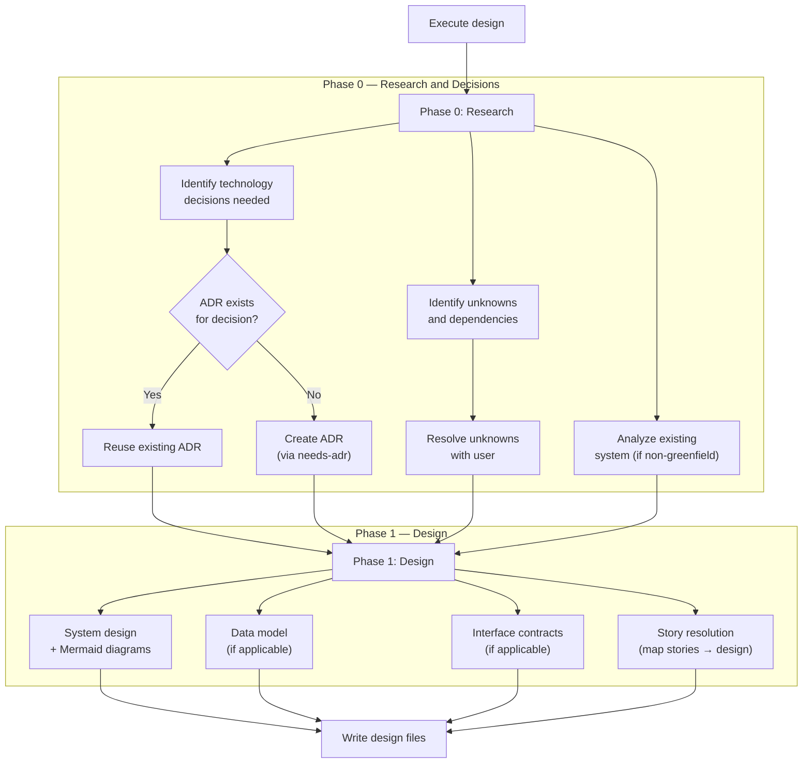
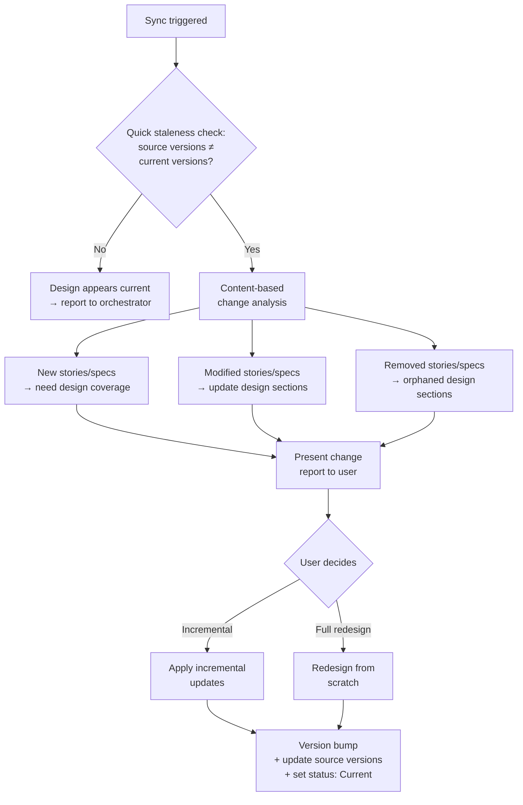

## Prerequisites

The `needs-adr` skill must be available. This skill invokes the ADR pattern when technology decisions are identified during the design process.

This skill is invoked by the `proven-intent` orchestrator, which provides the feature context (slug, intent, current state).

## Observe

Assess the current state of the design for this feature.

### 1. Read feature stories

Read `docs/features/<slug>/user-stories.adoc`. Extract `:version:`, all stories, acceptance criteria.

**If missing:** Report to the orchestrator that stories are missing. The orchestrator decides whether to create them first.

### 2. Read feature spec

Read `docs/features/<slug>/spec.adoc`. Extract `:version:`, all requirement IDs and texts.

**If missing:** Report to the orchestrator that specifications are unavailable. The orchestrator should invoke `needs-spec` first -- every feature gets a specification. As a fallback (e.g., partial transition recovery), the design can proceed with story-level acceptance criteria only. If proceeding without spec: set `:source-spec-version:` to `n/a` in the design output.

### 3. Read project-wide artifacts

- **`docs/adrs/`** -- read all ADRs with status `Accepted`. These are technology constraints.
- **`constraints.adoc`** -- read all constraints, particularly architecture and quality constraints.
- **`docs/architecture.adoc`** -- if it exists, understand the current system architecture for context.

### 4. Read existing design

If `docs/features/<slug>/design.adoc` exists:
- Read `:version:`, `:status:`, `:source-stories-version:`, `:source-spec-version:`
- Read the full design content

### 5. Analyze codebase

If this is not a greenfield project, analyze the current code structure to understand what already exists. Look at directory structure, key source files, configuration files, and existing patterns.

### 6. Report observation

Return to the orchestrator:
```
Feature: <slug>
Stories: {exists: true, version: "X.Y.Z"}
Spec: {exists: true/false, version: "X.Y.Z"}
Design: {exists: true/false, version: "X.Y.Z", status: "Current/Stale"}
ADRs: {count: N, accepted: N}
Constraints: {count: N, architecture: N, quality: N}
Codebase: {type: "TypeScript/Next.js", existing-patterns: [...]}
```

## Evaluate

Given the desired state from the orchestrator, determine what action is needed.

### 1. Does the desired state require design changes?

| Condition | Action |
|---|---|
| No design exists | Create new design |
| Design exists, source versions match current stories and spec | Design appears current. Report to orchestrator. |
| Design exists, source versions differ | Design is stale. Sync with upstream changes (incremental update or full redesign). |

### 2. Check constraints

- Verify proposed design elements against architecture constraints
- Verify design decisions respect ADR decisions
- Flag any constraint conflicts

### 3. Report evaluation

Return to the orchestrator:
```
Action: create / sync / none
Constraint conflicts: [list or none]
Technology decisions needed: [list or none]
```

## Execute



### Phase 0: Research and Decisions

Analyze all user stories and specs (if available) to identify:

1. **Technology decisions needed** -- for each story, what technology choices are required? Cross-reference against existing ADRs:
   - "US-003 requires persistent storage -- which database?" (if no ADR exists)
   - "US-005 requires real-time updates -- WebSocket or SSE?" (if no ADR exists)

2. **Unknowns and dependencies** -- external systems, third-party services, constraints needing clarification.

3. **Existing system analysis** (non-greenfield only) -- how is the current system structured? What patterns does it use? What can be reused vs. modified?

**For each technology decision not covered by an existing ADR:**
- Present the decision to the user with context and alternatives
- Ask whether to create an ADR for it (invoke `needs-adr` via the orchestrator)
- Record the decision in the design document regardless

**For each unknown:**
- Present it to the user as an open question
- Resolve before proceeding to Phase 1, or explicitly list as an open question in the design

### Phase 1: Design

Design the solution that solves the user stories while satisfying the specs (when available) and respecting all constraints.

**The design structure is adaptive.** Choose an organization appropriate for the project type. The sections below are guidance, not a rigid template.

#### System design

Describe the major components, modules, or services for this feature. For each:
- Its responsibility (what it does)
- Its interfaces (how other components interact with it)
- Key implementation details

Include Mermaid diagrams to clarify component relationships and key flows:

- **Component interaction diagram** (`flowchart`) -- at minimum one diagram showing how the feature's components relate and communicate. Required for every design.
- **Sequence diagram** (`sequenceDiagram`) -- for the primary user flow through the feature. Include when the flow involves multiple components or has non-obvious ordering.
- **State diagram** (`stateDiagram-v2`) -- for entities with meaningful state transitions (e.g., order lifecycle, session states). Include when the feature manages stateful entities.
- **Data flow diagram** (`flowchart`) -- when data moves through multiple components or transformations. Include when the data path is not obvious from the component diagram alone.

Embed diagrams inline in the relevant design sections using AsciiDoc `[mermaid]` blocks.

The structure depends on the project:

| Project Type | Typical Structure |
|---|---|
| Web application | Frontend components, backend services, database, API layer |
| CLI tool | Command parser, core logic modules, output formatters |
| Library/SDK | Public API surface, internal modules, extension points |
| Microservices | Service boundaries, communication patterns, shared infrastructure |
| Mobile app | Screens/views, state management, data layer, platform services |

**Independence rule:** The design must not depend on or reference other feature designs. It may reference project-wide ADRs and architecture.

#### Data model

If the feature involves persistent or structured data:
- Entities and their attributes
- Relationships between entities
- Validation rules derived from specs
- State transitions (if applicable)

Write this to a separate file `docs/features/<slug>/data-model.adoc` when the data model is non-trivial.

#### Interface contracts

If the feature exposes external interfaces:
- What interfaces exist (APIs, CLI commands, library exports, UI contracts)
- Input/output formats
- Error responses

Write these to `docs/features/<slug>/contracts/` when relevant.

#### Story resolution

For each user story in this feature, describe:
- **Which components are involved** in solving this story
- **How the acceptance criteria are met** by the design
- **Which spec IDs are satisfied** by which design elements (when specs are available)

This section is the proof that the design solves the stories. Every user story must appear here. When specs are available, every spec ID must be mapped to at least one design element. When specs are not available (`:source-spec-version:` is `n/a`), map acceptance criteria directly to design elements instead.

### Write design files

Create `docs/features/<slug>/design.adoc`:

```asciidoc
= Design: <Feature Name>
:version: 1.0.0
:status: Current
:source-stories-version: <user-stories version>
:source-spec-version: <spec version>
:last-updated: YYYY-MM-DD
:feature: <slug>
:toc:

== Technical Context

<Project overview. Greenfield or existing system. Current state relevant to this feature.>

== Decisions and Constraints

<References to relevant ADRs. Summary of technology decisions made during Phase 0.>

* <<../../adrs/0001-use-typescript.adoc#,ADR-0001>>: Use TypeScript
* <<../../adrs/0002-use-postgresql.adoc#,ADR-0002>>: Use PostgreSQL

== Research and Unknowns

<Findings from Phase 0. Resolved unknowns. Any remaining open questions.>

== System Design

<Adaptive structure -- components, modules, services, data flow.
 Organized appropriately for the project type.
 Scoped to this feature only.
 Include Mermaid diagrams: at minimum a component interaction diagram
 for the primary flow. Add sequence, state, or data flow diagrams
 where they clarify complex interactions.>

== Story Resolution

=== US-001: <Title>

Components:: <which components are involved>
Criteria::
* <acceptance criterion> -> <how the design meets it> (SPEC-ID)
* ...

=== US-002: <Title>

Components:: <which components are involved>
Criteria::
* ...
```

**`:status:` values:**
- `Current` -- design is valid and aligned with stories and specs
- `Stale` -- upstream stories or specs have changed since this design was created; sync needed

**Version rules:**
- `:version:` uses SemVer, starts at `1.0.0`
- `:source-stories-version:` records which user stories version was used
- `:source-spec-version:` records which spec version was used; set to `n/a` if spec was skipped
- `:last-updated:` set to today's date

**Additional files (when applicable):**
- `docs/features/<slug>/data-model.adoc` -- entity/data model
- `docs/features/<slug>/contracts/` -- interface contract files

### Sync workflow (when design already exists)

The design is a living document that stays in sync with stories and specs. When upstream artifacts change, the design is updated to reflect the new reality.



#### Quick staleness check

Compare `:source-stories-version:` and `:source-spec-version:` in `design.adoc` against the current versions of `user-stories.adoc` and `spec.adoc`. If versions match, inform the orchestrator that the design appears current.

#### Content-based change analysis

1. Read current stories and specs
2. Compare against the design's Story Resolution section
3. Identify:
   - **New stories/specs** -- not covered by the design
   - **Modified stories/specs** -- design elements need updating
   - **Removed stories/specs** -- design elements are orphaned

#### Present change report

```
Design sync: stories 1.0.0 -> 1.1.0, spec 1.0.0 -> 1.1.0

Added:
  - US-003 needs new components and story resolution entry
  - CART-009, CART-010 need design coverage

Modified:
  - US-001 criteria changed -- CartService logic needs revision

Removed:
  - US-002 removed -- Cart Page and related design sections orphaned

Sections unaffected: Technical Context, Decisions and Constraints
```

Ask the user whether to apply incrementally or redesign from scratch.

#### Apply changes

1. **Preserve stable sections:** Keep design sections unaffected by changes.
2. **Update affected sections:** Modify design sections impacted by changed stories or specs.
3. **Remove orphaned sections:** Remove design elements that existed solely for removed stories.
4. **Update Story Resolution:** Re-map all stories, ensuring every current story and spec ID is accounted for.
5. **Bump version:** MAJOR if elements removed, MINOR if added/modified, PATCH if metadata only.
6. **Update source versions:** Set `:source-stories-version:` and `:source-spec-version:` to current. Set `:status:` to `Current`. Update `:last-updated:`.

### Post-implementation reconciliation

This mode is invoked by the orchestrator after `needs-implementation` reports design divergences and the user has decided which divergences should be resolved by updating the design (vs. fixing the code).

The orchestrator passes:
- The list of divergences where the user chose "update design"
- For each: what the design specified, what was implemented, and the rationale

**Steps:**

1. For each divergence routed to this skill:
   a. Locate the relevant design sections (system design, story resolution, data model, contracts)
   b. Update the design to accurately reflect what was built
   c. Ensure the Story Resolution section still correctly maps stories to design elements
2. Verify that the updated design remains internally consistent (no orphaned references, no contradictions between sections)
3. Bump version: PATCH if minor clarifications, MINOR if substantive structural changes
4. Keep `:status:` as `Current` -- the design remains a living document
5. Update `:last-updated:` to today's date

## Quality Checklist

Before finalizing, verify:
- Every user story in this feature is addressed in Story Resolution
- Every spec ID is mapped to at least one design element (skip if `:source-spec-version:` is `n/a`)
- All ADR decisions are respected in the design
- All architecture constraints from `constraints.adoc` are satisfied
- No unresolved unknowns remain (or are explicitly listed)
- Design is implementable (specific enough to code from)
- Design does not depend on other feature designs
- Source versions are recorded correctly
- Data model covers all entities implied by the stories (if applicable)
- Interface contracts match the spec requirements (if applicable)
- At least one Mermaid component interaction diagram is included in System Design
- Diagrams accurately reflect the components and flows described in prose
- Sequence diagrams cover the primary user flow (when the flow involves multiple components)

## Reference

See `references/example.adoc` for a complete example showing how a feature's stories and specs become a design document with story resolution mapping.
