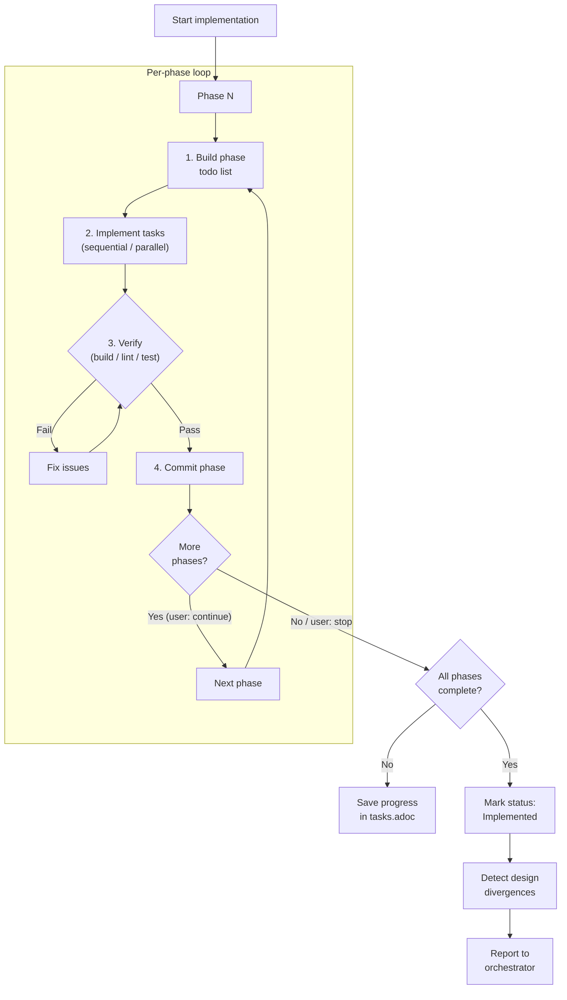

## Prerequisites

This skill is invoked by the `proven-needs` orchestrator, which provides the feature context (slug, intent, current state).

## Observe

Assess the current state of implementation for this feature.

### 1. Read feature task list

Read `docs/features/<slug>/tasks.adoc`. Extract `:version:`, `:status:`, all phases, all tasks with metadata (Components, Stories, Specs, Description, parallel/sequential markers, tick states).

**If missing:** Check whether `docs/features/<slug>/design.adoc` exists. If so, note that implementation will follow the design's Story Resolution section story-by-story (no phased execution). If neither tasks nor design exist, report to the orchestrator that at minimum a design is needed.

### 2. Read feature design

Read `docs/features/<slug>/design.adoc`. Extract system design sections, story resolution mappings, architectural decisions. Also read `data-model.adoc` and files in `contracts/` if they exist.

**If missing:** Note that implementation will lack architectural guidance.

### 3. Read feature stories and spec

- **`docs/features/<slug>/user-stories.adoc`** -- for context on acceptance criteria.
- **`docs/features/<slug>/spec.adoc`** -- for testable requirements context.

### 4. Read project-wide artifacts

- **`constraints.adoc`** -- identify quality, architecture, and performance constraints that apply during implementation.
- **`docs/adrs/`** -- technology decisions that affect implementation choices.

### 5. Analyze codebase

Analyze current code structure, existing patterns, frameworks, and conventions to ensure new code is consistent.

### 6. Report observation

Return to the orchestrator:
```
Feature: <slug>
Tasks: {exists: true/false, status: "Current/Stale/Implemented", progress: "N/M ticked", phases: N}
Design: {exists: true/false, status: "Current/Stale"}
Implementation: {started: true/false, phases-complete: N, current-phase: N}
Codebase: {conventions: [...], build-status: pass/fail, test-status: pass/fail}
```

## Evaluate

Given the desired state from the orchestrator, determine what action is needed.

### 1. Does the desired state require implementation?

| Condition | Action |
|---|---|
| No tasks exist, no design exists | Cannot implement. Report to orchestrator. |
| Tasks exist, `:status:` is `Implemented` | Already complete. Report to orchestrator. |
| Tasks exist, `:status:` is `Stale` | Warn that task list is stale. Ask orchestrator whether to proceed or update tasks first. |
| Tasks exist, some ticked | Partial progress. Determine resume point. |
| Tasks exist, none ticked | Start from Phase 1. |
| No tasks, design exists | Story-by-story implementation from design. |

### 2. Check constraints

- Quality constraints: tests required? coverage thresholds?
- Architecture constraints: code organization rules?
- Performance constraints: response time requirements?

### 3. Report evaluation

Return to the orchestrator:
```
Action: implement / resume / story-by-story / none
Start point: Phase N / Story US-NNN
Constraint requirements: [testing, coverage threshold, architecture rules]
```

## Execute



### Phase-by-phase implementation (from task list)

Steps 1--5 repeat for each phase.

#### 1. Build phase todo list

Parse the tasks for the **current phase only** from the feature's `tasks.adoc`. Create a tracking list. If a todo-list tool is available (e.g., TodoWrite), use it. Otherwise, track by ticking tasks in `tasks.adoc`.

- Each task title becomes a todo item, prefixed with its task ID
- All items start as `pending`
- Do **not** include tasks from other phases

#### 2. Implement current phase

Work through tasks following the task list exactly. Do not skip, reorder, or add tasks.

**For each task:**

1. Mark the task as `in_progress`
2. Read the design document sections referenced in the task's `Components::` field
3. Implement the code as described in the task's `Description::` and informed by the design
4. Mark the task as `completed`
5. Tick the task `[x]` in `docs/features/<slug>/tasks.adoc`

**Ordering within a phase:**
- **`[sequential]`** tasks: implement in order
- **`[parallel]`** tasks: may be implemented in any order

**Implementation principles:**
- Follow the design document for architecture, component structure, data model, and contracts
- Follow the task description for scope -- implement exactly what it describes, nothing more
- Match existing codebase conventions (naming, file structure, patterns, formatting)
- Write production-quality code -- no placeholders, no TODOs, no stubs (unless the task explicitly calls for one)
- Respect all constraints from `constraints.adoc` (architecture rules, quality standards)

#### 3. Verify phase

After all tasks in the current phase are implemented:

1. Detect the project's verification commands by checking for `package.json`, `Makefile`, `Cargo.toml`, `pyproject.toml`, or similar
2. Run the build/compile step
3. Run the linter/type checker if available
4. Run the test suite if available
5. If any verification step fails, fix before proceeding

**Constraint verification:**
- Check that quality constraints are satisfied (e.g., test coverage hasn't decreased)
- Check that architecture constraints are respected (e.g., business logic in service layer)

#### 4. Commit phase

After verification passes:

1. Stage all new and modified files relevant to this phase
2. Create a commit: `feat(<feature-slug>): implement phase N -- <Phase Name>` with a body listing completed task IDs
3. If commit fails due to GPG signing, inform user and wait for retry confirmation

#### 5. Ask to continue

**If more phases remain:**
Present options:
- "Continue to Phase N: \<Phase Name\>"
- "Stop here" -- progress is saved in `tasks.adoc`

**If all phases are complete:**
1. Set `:status: Implemented` in `docs/features/<slug>/tasks.adoc`
2. Detect design divergences (see below)
3. Update `:last-updated:` to today's date in updated files
4. Commit task status updates
5. Report to the orchestrator that implementation is complete, along with any divergence report

#### Design divergence detection

**This step is MANDATORY after all phases complete. Do not skip it.**

Re-read the feature's design document and compare section-by-section against the actual implementation:

1. **Re-read `docs/features/<slug>/design.adoc` in full.** Do not rely on memory of what the design said -- read the file again now.
2. **For each section in System Design:**
   a. Identify what the design specified (components, interfaces, data flow, technology choices)
   b. Compare against what was actually implemented in code
   c. Note any differences: additions not in the design, omissions from the design, structural changes, different technology choices
3. **For each entry in Story Resolution:**
   a. Verify the implementation satisfies the criteria as designed
   b. Note any differences in approach or component usage
4. **If `data-model.adoc` or `contracts/` files exist:** Compare those against the actual data schema and interfaces in code.
5. **Produce a divergence report -- even if no divergences were found.** An explicit "No divergences detected" confirms the check was performed.

For each divergence found:

1. **Describe the divergence:** What the design specified vs. what was actually built
2. **Analyze both resolution directions:**
   - **Update design:** Explain why updating the design to match the implementation makes sense (e.g., "the design described a separate CartService, but in practice the logic was simpler and fit directly in the route handler")
   - **Fix code:** Explain why adjusting the implementation to match the design makes sense (e.g., "the architecture constraint requires business logic in the service layer, not route handlers")
3. **Provide context:** Why the implementation diverged -- was it a practical constraint, a better approach discovered during coding, a misunderstanding in the design, or an oversight?

Report all divergences to the orchestrator in a structured format:

```
Design divergences for <slug>:

  1. CartService validation placement
     Design: Validation logic in CartService.addItem()
     Implementation: Validation in POST /api/cart route handler
     Reason: Zod schema validation felt more natural at the API boundary
     Update design: Reflect route-level validation pattern (aligns with how other routes work)
     Fix code: Move validation into CartService (satisfies architecture constraint: business logic in service layer)

  2. ...

(or: "No divergences detected.")
```

The orchestrator presents this to the user for decision-making. This skill does NOT modify `design.adoc` -- design updates are routed to `needs-design` by the orchestrator.

### Story-by-story implementation (when no task list exists)

When implementing directly from the design without a task list:

1. **Read the Story Resolution section** of the feature's `design.adoc`.

2. **Implement one story at a time**, in order. For each story:
   a. Create a tracking list for the story
   b. Read `Components::` and `Criteria::` fields
   c. Implement all design elements mapped to the story's criteria
   d. If a component is shared and already partially implemented, extend rather than duplicate

3. **Verify after each story** (build, lint, typecheck, test).

4. **Commit after each story:** `feat(<feature-slug>): implement US-NNN -- <Story Title>`

5. **Ask to continue** after each story.

6. **When all stories are implemented:**
   a. Detect design divergences using the same process described in "Design divergence detection" above. Report all divergences to the orchestrator with structured analysis of both resolution directions. Do NOT modify `design.adoc` directly.
   b. Update `:last-updated:` in modified files
   c. Commit any updates
   d. Report to the orchestrator with the divergence report

**Note:** No `tasks.adoc` is created in this flow. Progress is tracked via commits.

## Reference

See `references/example.adoc` for a walkthrough showing how a feature's Phase 1 tasks become implemented code.
