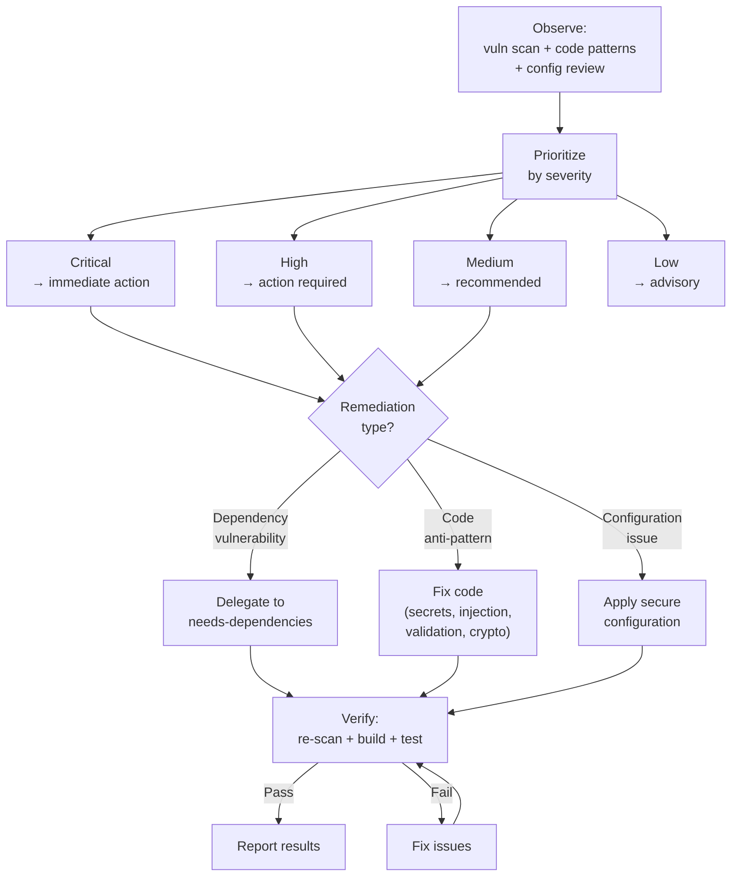

## Prerequisites

This skill is invoked by the `proven-intent` orchestrator, which provides the desired state and current state context.

## Observe

Assess the current security posture of the project.

### 1. Dependency vulnerabilities

Run the appropriate audit tool for the project's package manager:
- `npm audit` / `yarn audit` / `pnpm audit`
- `cargo audit`
- `pip-audit`
- `bundle-audit`

Collect all known CVEs with severity levels (Critical, High, Medium, Low).

### 2. Code pattern analysis

Scan the codebase for common security anti-patterns:

| Pattern | Risk | Detection |
|---|---|---|
| Hardcoded secrets | High | API keys, passwords, tokens in source files |
| SQL injection | High | String concatenation in queries |
| Insecure deserialization | High | Unvalidated deserialization of external data |
| Missing input validation | Medium | User inputs passed directly to business logic |
| Insecure defaults | Medium | Default passwords, debug modes in production config |
| Missing authentication | Medium | Endpoints without auth checks |
| Sensitive data in logs | Medium | PII or credentials logged |
| Insecure crypto | Medium | Weak algorithms (MD5, SHA1 for security), small key sizes |

### 3. Configuration review

Check for security-relevant configuration issues:
- CORS settings
- HTTPS enforcement
- Cookie security flags (httpOnly, secure, sameSite)
- Rate limiting configuration
- Authentication/authorization configuration

### 4. Read constraints

Read `constraints.adoc` from the project root. Identify all security constraints.

### 5. Report observation

Return to the orchestrator:
```
Security posture:
  dependency-vulnerabilities: {critical: N, high: N, medium: N, low: N}
  code-patterns: [{pattern, severity, file, line}]
  configuration-issues: [{issue, severity}]
  constraint-violations: [list]
```

## Evaluate

Given the desired state from the orchestrator, determine what action is needed.

### 1. Map desired state to actions

| Desired State | Actions |
|---|---|
| "No known vulnerabilities" | Patch dependencies (delegate to `needs-dependencies`), remediate code patterns |
| "No hardcoded secrets" | Move secrets to environment variables or secret management |
| "All user input validated" | Add validation layers where missing |
| "Security best practices" | Address all findings by severity (Critical first) |

### 2. Prioritize by severity

1. Critical vulnerabilities and hardcoded secrets → immediate action
2. High severity findings → action required
3. Medium severity → recommended action
4. Low severity → advisory

### 3. Check constraint implications

- Which constraint violations would be resolved?
- Would any remediation introduce new issues (e.g., breaking API compatibility)?

### 4. Report evaluation

Return to the orchestrator:
```
Action: remediate / audit-only / none
Findings by severity: {critical: N, high: N, medium: N, low: N}
Proposed remediations: [{finding, remediation, risk, files-affected}]
Dependency actions: [delegate to needs-dependencies]
```

## Execute



### 1. Dependency remediations

For dependency vulnerabilities, delegate to the `needs-dependencies` capability via the orchestrator. This skill focuses on code and configuration remediations.

### 2. Code remediations

For each approved remediation:
1. Apply the fix (move secrets, add validation, fix injection, etc.)
2. Verify the fix doesn't break existing functionality

### 3. Configuration remediations

For each configuration issue:
1. Apply the secure configuration
2. Document the change

### 4. Verify

After all remediations:
1. Re-run security scans to confirm findings are resolved
2. Run the build and test suite to confirm nothing is broken
3. Verify all security constraints are satisfied

### 5. Report results

Return to the orchestrator:
```
Remediations applied: [{finding, fix, status}]
Verification: {security-scan: pass/fail, build: pass/fail, tests: pass/fail}
Constraint violations resolved: [list]
Remaining findings: [list or none]
```

## Reference

See `references/example.adoc` for an example showing a security assessment and remediation cycle.
