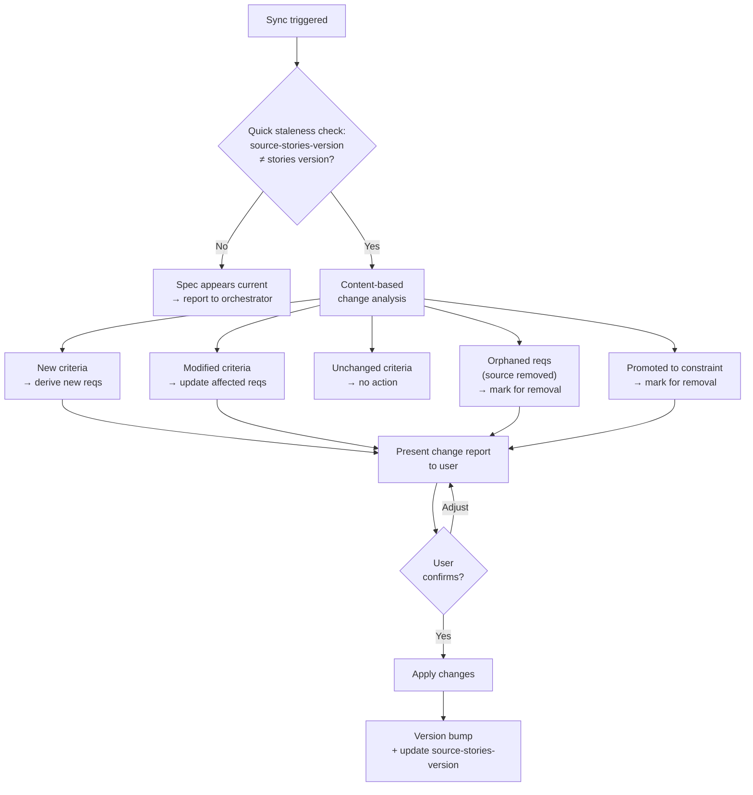

## Prerequisites

Load the `ears-requirements` skill before writing requirements. It provides the EARS sentence types and templates.

This skill is invoked by the `proven-intent` orchestrator, which provides the feature context (slug, intent, current state).

## Observe

Assess the current state of specifications for this feature.

### 1. Read feature stories

Read `docs/features/<slug>/user-stories.adoc`. Extract:
- `:version:`
- All stories with their acceptance criteria

**If the file does not exist:** Report to the orchestrator that stories are missing. The orchestrator decides whether to create them first.

### 2. Read existing spec

If `docs/features/<slug>/spec.adoc` exists:
- Read `:version:`, `:source-stories-version:`, `:last-updated:`
- Extract all requirement IDs, texts, types, sources, and verifications
- Count total requirements

### 3. Read constraints

Read `constraints.adoc` from the project root. Identify constraints that overlap with this feature's domain -- these do not need to be duplicated as specs.

### 4. Report observation

Return to the orchestrator:
```
Feature: <slug>
Stories: {exists: true, version: "X.Y.Z", count: N}
Spec: {exists: true/false, version: "X.Y.Z", source-stories-version: "X.Y.Z", stale: true/false, count: N}
Overlapping constraints: [list]
```

## Evaluate

Given the desired state from the orchestrator, determine what action is needed.

### 1. Does the desired state require spec changes?

- If no spec exists → create spec
- If spec exists but stories version differs → sync spec
- If spec exists and versions match → check content alignment, report if current

### 2. Check constraints

- Requirements that duplicate a project-wide constraint should not appear in the feature spec
- If an existing spec contains a requirement that has since been promoted to a constraint, flag it for removal

### 3. Report evaluation

Return to the orchestrator:
```
Action: create / sync / none
Requirements to add: N
Requirements to modify: N
Requirements to remove: N (including constraint overlaps)
Constraint issues: [list or none]
```

## Execute

### Creating a new spec

#### 1. Derive requirements

For each acceptance criterion across all stories in this feature:

1. Translate it into one or more black-box testable EARS requirements
2. Assign a unique ID: `<PREFIX>-<NNN>` where PREFIX is a 2-5 character uppercase prefix derived from the feature slug

**Prefix derivation:** Create a short, meaningful prefix from the feature slug:
- `product-browsing` → `PROD`
- `shopping-cart` → `CART`
- `checkout` → `CHK`
- `user-authentication` → `AUTH`
- `password-reset-sms` → `PRS`

Present the proposed prefix to the user for confirmation before proceeding.

**Black-box testing constraint -- the litmus test:**

> Could a tester who has never seen the source code verify this requirement using only the system's user interface or public APIs? If not, rewrite it.

Requirements must NOT reference:
- Internal architecture, components, or modules
- Database schemas, tables, or queries
- API endpoint paths or HTTP methods
- Programming languages, frameworks, or libraries
- Internal data structures or algorithms
- File system paths or internal configuration

Requirements MUST describe:
- What the user or external actor observes
- What inputs produce what outputs
- Observable system states and transitions
- Timing and performance from the user's perspective
- Error messages and feedback presented to the user

**Constraint filtering:** If a derived requirement is already covered by a constraint in `constraints.adoc`, do not include it in the spec. Instead, note in the spec that the constraint applies:

```asciidoc
NOTE: Password strength requirements are enforced by project constraint (Security: "Passwords must be at least 8 characters with mixed case and numbers"). Not duplicated here.
```

**Multi-source requirements:** A single requirement may be derived from criteria across multiple stories within this feature. Use comma-separated sources: `Source:: US-001: Criterion 3, US-002: Criterion 1`.

#### 2. Write the spec file

Create `docs/features/<slug>/spec.adoc`:

```asciidoc
= Specification: <Feature Name>
:version: 1.0.0
:source-stories-version: <user-stories version>
:last-updated: YYYY-MM-DD
:feature: <slug>
:prefix: <PREFIX>
:toc:

== <PREFIX>-001
The system shall display products in a grid or list format.

Type:: Ubiquitous
Source:: US-001: View Product Catalog, Criterion 1
Verification:: Open the product catalog page. Confirm that products are displayed in a grid or list layout.

== <PREFIX>-002
When the user selects a category filter, the system shall display only products in that category.

Type:: Event-driven
Source:: US-001: View Product Catalog, Criterion 3
Verification:: Select a category filter. Confirm that only products in the selected category are displayed.

== Traceability

[cols="1,2,2", options="header"]
|===
| Requirement ID | Requirement Summary | Source

| <PREFIX>-001
| Product display format
| US-001: Criterion 1

| <PREFIX>-002
| Category filtering
| US-001: Criterion 3
|===
```

Each requirement includes:
- The EARS requirement text as the section content
- `Type` -- the EARS sentence type used
- `Source` -- traceability to user story and criterion within this feature
- `Verification` -- a brief black-box test description

### Syncing an existing spec



#### 1. Quick staleness check

Compare `:source-stories-version:` in `spec.adoc` against `:version:` in `user-stories.adoc`. If versions match, inform the orchestrator that the spec appears current. The orchestrator decides whether to force re-analysis.

#### 2. Content-based change analysis

1. Read all current stories and their acceptance criteria
2. Read all existing requirements and their `Source` traceability links
3. For each story criterion, determine:
   - **New** -- no corresponding requirement exists → derive new requirements
   - **Modified** -- the source criterion wording or intent changed → update affected requirements
   - **Unchanged** -- criterion and corresponding requirement still align → no action
4. For each existing requirement, check if its source criterion still exists:
   - **Orphaned** -- source criterion was removed → mark for removal
5. Check for requirements that now overlap with constraints added since last sync:
   - **Promoted to constraint** -- requirement is now covered by `constraints.adoc` → mark for removal

#### 3. Present change report

```
Spec sync: stories 1.0.0 -> 1.1.0

Added:
  - PROD-005: [new requirement summary]

Modified:
  - PROD-002: [old text] -> [new text]

Removed:
  - PROD-004: [reason - source US-003 removed]
  - PROD-006: [promoted to project constraint]

No changes to: PROD-001, PROD-003
```

Ask the user to confirm before applying changes.

#### 4. Apply changes and bump versions

| Change Type | Version Bump |
|---|---|
| Requirements removed | MAJOR |
| Requirements added or modified | MINOR |
| Traceability or metadata updates only | PATCH |

- Update `:source-stories-version:` to match current stories version
- Update `:version:` according to bump rules
- Update `:last-updated:` to today's date
- Update the traceability section

## Quality Checklist

Before finalizing, verify every item:
- Every requirement uses the correct EARS sentence type
- Every requirement passes the black-box litmus test
- Every requirement has a unique ID with the feature prefix
- Every requirement traces back to at least one story criterion within this feature
- Multi-source requirements list all sources
- No duplicate or conflicting requirements
- No requirements that duplicate project-wide constraints
- The traceability section is complete
- Version numbers are correct and updated
- `:source-stories-version:` matches the stories `:version:`

## Reference

See `references/example.adoc` for a complete example showing how feature stories become a feature specification.
