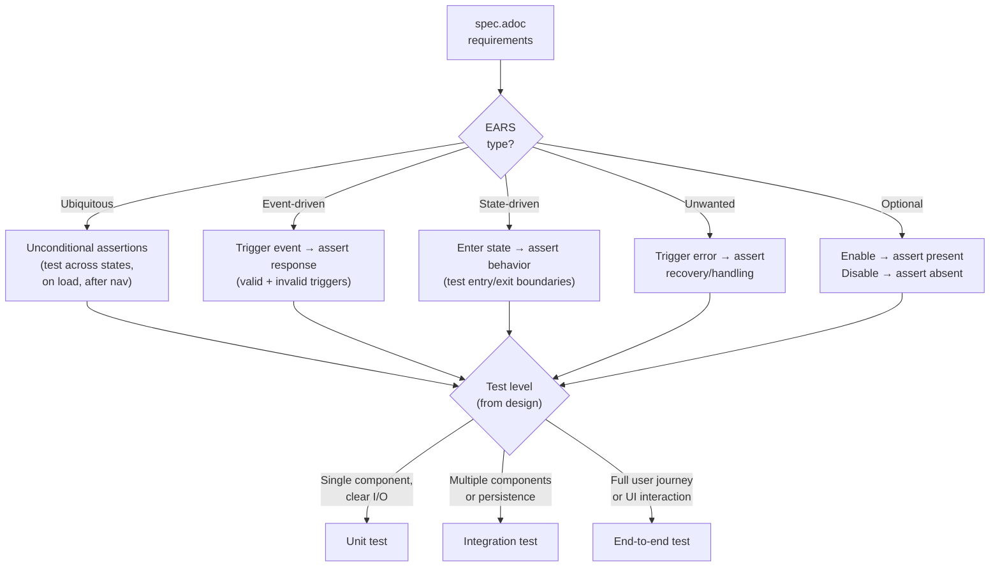

## Prerequisites

This skill is invoked by the `proven-needs` orchestrator, which provides the feature context (slug, intent, current state).

## Observe

Assess the current state of tests for this feature.

### 1. Read feature spec

Read `docs/features/<slug>/spec.adoc`. Extract all requirement IDs, EARS requirement texts, types, and verification descriptions.

**If missing:** Report to the orchestrator that specs are missing. Tests cannot be derived without specifications -- the verification descriptions in the spec are the primary source for test cases.

### 2. Read feature design

Read `docs/features/<slug>/design.adoc`. Extract system design sections, interface contracts, and data model information. These inform test setup, fixtures, and integration points.

**If missing:** Note that tests will be limited to black-box behavioral tests without internal structure guidance.

### 3. Read feature stories

Read `docs/features/<slug>/user-stories.adoc` for context on acceptance criteria and user journeys. Stories provide the narrative context that helps write meaningful test descriptions.

### 4. Read existing tests

Scan the project's test directories for existing test files related to this feature:
- Match by feature slug in file/directory names
- Match by spec ID references in test descriptions
- Check for existing test infrastructure (helpers, fixtures, factories)

### 5. Read constraints

Read `constraints.adoc` from the project root. Identify quality constraints relevant to testing (coverage thresholds, test requirements).

### 6. Analyze test infrastructure

Detect the project's test framework and conventions:
- **JavaScript/TypeScript:** Jest, Vitest, Mocha, Playwright, Cypress
- **Rust:** built-in test framework, integration test conventions
- **Go:** testing package, testify
- **Python:** pytest, unittest
- **Ruby:** RSpec, Minitest

Note: test file locations, naming conventions, assertion style, existing fixtures/helpers.

### 7. Report observation

Return to the orchestrator:
```
Feature: <slug>
Spec: {exists: true, version: "X.Y.Z", requirement-count: N}
Design: {exists: true/false}
Existing tests: {count: N, spec-ids-covered: [...], spec-ids-missing: [...]}
Test framework: <framework>
Coverage constraints: [list or none]
```

## Evaluate

Given the desired state from the orchestrator, determine what action is needed.

### 1. Does the desired state require test changes?

| Condition | Action |
|---|---|
| No tests exist for this feature | Generate full test suite |
| Tests exist but spec has been updated (new/modified requirements) | Generate tests for new requirements, update tests for modified requirements |
| Tests exist and cover all current spec IDs | Tests appear current. Report to orchestrator. |
| Tests exist but some spec IDs are not covered | Generate tests for uncovered requirements |

### 2. Check constraints

- Quality constraints: coverage thresholds that must be met
- Are there requirements for specific test types (unit, integration, e2e)?

### 3. Report evaluation

Return to the orchestrator:
```
Action: generate / update / none
Requirements to test: N (new: N, modified: N, uncovered: N)
Constraint requirements: [coverage threshold, test type requirements]
```

## Execute



### Derive test cases from specifications

For each requirement in `spec.adoc` that needs a test:

#### 1. Analyze the requirement

Read the EARS requirement text, type, and verification description. The verification field describes the black-box test scenario in plain language -- this is the primary source for the test case.

| EARS Type | Test Pattern |
|---|---|
| Ubiquitous | Assert the behavior holds unconditionally. Test on page load, after navigation, across states. |
| Event-driven | Trigger the event, assert the response. Test with valid and invalid triggers. |
| State-driven | Enter the state, assert the behavior. Test state entry and exit boundaries. |
| Unwanted behavior | Trigger the error condition, assert the recovery/handling response. |
| Optional feature | Enable the feature, assert behavior. Disable, assert absence. |

#### 2. Determine test level

Based on the requirement and available design information:

| Test Level | When to Use |
|---|---|
| **Unit test** | Requirement maps to a single component with clear inputs/outputs (from design) |
| **Integration test** | Requirement spans multiple components or involves data persistence |
| **End-to-end test** | Requirement describes a full user journey or UI interaction |

When the design is available, use the Story Resolution section to identify which components are involved -- this informs the test level. When no design is available, default to integration or e2e tests (black-box by nature).

#### 3. Write the test case

Each test case must:
- Reference the spec ID in the test description (e.g., `"PROD-001: displays products in grid or list format"`)
- Follow the project's existing test conventions (file naming, assertion style, setup/teardown patterns)
- Include the happy path from the verification description
- Include at least one edge case or error scenario derived from the EARS type
- Use existing test infrastructure (factories, fixtures, helpers) where available

### Organize test files

Follow the project's existing test file organization. If no convention exists, use:

```
tests/
└── features/
    └── <feature-slug>/
        ├── <component>.test.<ext>    # Unit tests (when design is available)
        ├── <feature-slug>.test.<ext> # Integration tests
        └── <feature-slug>.e2e.<ext>  # End-to-end tests (if applicable)
```

### Write test files

For each test file, include:

```
// Test file header pattern (adapt to language/framework)
//
// Feature: <feature-slug>
// Spec version: <spec version>
// Generated from: spec.adoc
//
// Spec coverage:
//   PROD-001: displays products in grid or list format
//   PROD-002: category filtering
//   ...
```

Each test block:

```
describe("<PREFIX>-<NNN>: <requirement summary>", () => {
  it("should <verification description - happy path>", () => {
    // Test implementation derived from spec verification field
  });

  it("should <edge case or error scenario>", () => {
    // Additional test derived from EARS type analysis
  });
});
```

### Verify

After writing tests:

1. Run the test suite to confirm all new tests pass (or identify failures that indicate implementation gaps)
2. Check coverage against constraints if applicable
3. Verify that every spec ID has at least one corresponding test

### Report results

Return to the orchestrator:
```
Tests generated:
  Files: N new, N modified
  Test cases: N total (N unit, N integration, N e2e)
  Spec coverage: N/N requirement IDs covered
  Test results: N passed, N failed
  Coverage: X% (constraint threshold: Y%)
```

If any tests fail, report the failures. Failing tests may indicate:
- Implementation gaps (code doesn't satisfy the spec yet)
- Test setup issues (fixtures, configuration)
- Spec/implementation divergences (the implementation satisfies the intent but doesn't match the spec's exact wording)

## Quality Checklist

Before finalizing, verify:
- Every spec ID has at least one test case
- Test descriptions reference their spec ID for traceability
- Tests follow the project's existing conventions (naming, structure, assertion style)
- Edge cases and error scenarios are covered (especially for unwanted-behavior EARS types)
- Tests use existing test infrastructure (no duplicate helpers or fixtures)
- Test file organization matches project conventions
- All tests pass (or failures are reported with analysis)
- Coverage constraints from `constraints.adoc` are satisfied
- Spec version is recorded in test file headers for staleness detection

## Reference

See `references/example.adoc` for a complete example showing how feature specifications become executable test cases.
