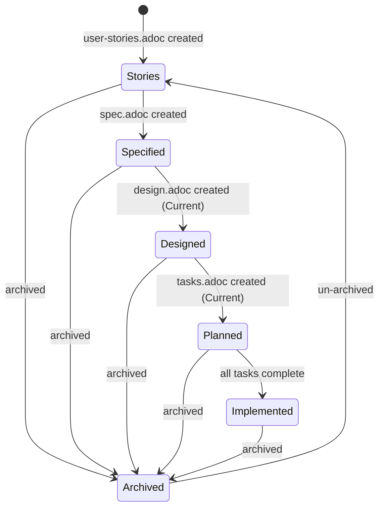

## Purpose

Continuously evolve a software system by declaring a desired state, evaluating it against the current state and constraints, then executing the minimal valid transition to make it true. Both maintenance and feature work are state changes, not task accumulation.

## State Transition Loop

```
Observe → Declare → Evaluate → Derive → Execute → Validate → Repeat
```

1. **Observe** -- capture the current state (automated)
2. **Declare** -- accept a desired state (from user or system-proposed)
3. **Evaluate** -- test feasibility against current state and constraints
4. **Derive** -- determine the minimal transition plan
5. **Execute** -- invoke capabilities to apply changes
6. **Validate** -- verify the desired state is now true
7. **Repeat** -- declare the next desired state

## Core Concepts

### Current State

The observable, verifiable reality of the system right now. Computed fresh each invocation, never stored.

**Artifact state:**
- Which feature packages exist in `docs/features/`
- For each feature: which artifacts exist (stories, spec, design, tasks), their versions, statuses
- Project-wide artifacts: `constraints.adoc`, `docs/adrs/`, `docs/architecture.adoc`, `docs/state-log.adoc`
- Staleness: are any artifacts out of sync with their upstream?

**Codebase state:**
- Language, framework, project structure
- Dependency graph and versions (from package.json, Cargo.toml, go.mod, etc.)
- Test coverage and test status
- Lint and build status
- Security posture (known vulnerabilities in dependencies)

### Desired State

A declarative statement of what must be true after this transition. Desired states come from:
- The user (explicit intent)
- The system (detected conditions, proposed to user)

Examples:
- "Users can reset their password via SMS" (feature)
- "All dependencies have no known critical vulnerabilities" (maintenance)
- "The architecture document reflects the current system" (documentation)
- "All API endpoints enforce rate limiting" (constraint)

### Constraints (Invariants)

Rules that must not be violated across any transition. Defined in `constraints.adoc` at the project root. See the Constraints section below for the full specification.

### Feature Package

A self-contained unit of work scoped to one feature. Lives in `docs/features/<slug>/`:

```
docs/features/<slug>/
├── user-stories.adoc    # WHY: user needs and motivations
├── spec.adoc            # WHAT: testable requirements for this feature
├── design.adoc          # HOW: implementation blueprint
└── tasks.adoc           # WORK: phased implementation breakdown
```

Each feature package is fully independent -- it can be specified, designed, and implemented without reading other feature packages. Feature designs reference project-wide ADRs and architecture but never other feature designs.

### State Log

An append-only audit trail of all state transitions. Lives at `docs/state-log.adoc`. See the State Log section below for the format.

## Capabilities

The orchestrator does not produce artifacts directly. It invokes capabilities (the `needs-*` skills) to perform work. Each capability follows the observe/evaluate/execute pattern.

### Feature-scoped capabilities

These operate within a single feature package:

| Capability | Skill | Domain |
|---|---|---|
| Stories | `needs-stories` | Create/update user stories for a feature |
| Specifications | `needs-spec` | Derive testable requirements from stories |
| Design | `needs-design` | Create implementation blueprint for a feature |
| Tasks | `needs-tasks` | Break design into phased implementation units |
| Implementation | `needs-implementation` | Write and verify code for a feature |
| Tests | `needs-tests` | Derive and generate tests from specifications |

### Project-wide capabilities

These operate at the project level:

| Capability | Skill | Domain |
|---|---|---|
| ADRs | `needs-adr` | Record technology decisions |
| Architecture | `needs-architecture` | Document current system architecture |
| Dependencies | `needs-dependencies` | Manage and update dependency graph |
| Security | `needs-security` | Assess and remediate security posture |
| Compliance | `needs-compliance` | Verify license and policy compliance |

### Supporting skills

| Skill | Purpose |
|---|---|
| `ears-requirements` | EARS methodology reference for stories and specs |

## Workflow

### 1. Observe Current State

When this skill is invoked, immediately build the current state model:

#### 1.1 Read project-wide artifacts

1. **`constraints.adoc`** -- read all constraint categories and rules. If missing, note that no constraints are defined. Do not create it automatically -- the user declares constraints intentionally.

2. **`docs/features/`** -- list all feature directories. For each, check which artifacts exist and read their `:version:` and `:status:` attributes. Features with `:status: Archived` in `user-stories.adoc` are reported in the summary but skipped during intent classification and staleness checks.

3. **`docs/adrs/`** -- read the index, note how many ADRs exist and their statuses.

4. **`docs/architecture.adoc`** -- check existence, read `:version:` if present.

5. **`docs/state-log.adoc`** -- check existence, read recent transitions for context. Pay particular attention to any transitions with `:result: Partial` -- these indicate work that was started but not completed. The partial transition's `:features:` and `:capabilities-invoked:` fields provide useful context for understanding why artifacts are in their current state (e.g., stories and spec exist but design is missing because a prior transition was stopped mid-way).

#### 1.2 Analyze codebase

1. **Project type** -- detect language, framework, build system from configuration files (package.json, Cargo.toml, go.mod, pyproject.toml, etc.)

2. **Dependencies** -- parse dependency files. Identify outdated packages, known vulnerabilities, archived/unmaintained packages, license information.

3. **Quality signals** -- check if build passes, linting passes, tests pass. Read test coverage if available.

4. **Code structure** -- understand directory layout, module organization, existing patterns.

#### 1.3 Present state summary

Present a concise summary to the user:

```
Current state:
  Features: 3 (user-auth [implemented], user-profile [designed], shopping-cart [stories only])
  Constraints: 8 rules across 4 categories
  ADRs: 2 accepted
  Architecture: v1.0.0 (current)
  Codebase: TypeScript/Next.js, 47 deps (1 vulnerable), 78% coverage, build passing
  Constraint violations: specs stale in user-profile (stories updated since spec)
```

### 2. Accept Desired State

The user states what they want to be true. The orchestrator interprets this as a desired state.

#### 2.1 Intent classification

Classify the desired state into one or more intent types:

| Intent Type | Signals | Example |
|---|---|---|
| **Feature evolution** | Describes user-facing capability, has a user journey | "Users can reset password via SMS" |
| **Constraint declaration** | Universal quantifiers, system-as-subject, applies to features that don't exist yet | "All API endpoints must enforce rate limiting" |
| **Artifact maintenance** | References existing artifacts, sync/update language | "Specs are in sync with current stories" |
| **Dependency maintenance** | References packages, versions, vulnerabilities | "No dependencies have known vulnerabilities" |
| **Architecture evolution** | References system structure, technology changes | "Authentication uses OAuth2 instead of sessions" |
| **Quality improvement** | References tests, coverage, code quality | "All API endpoints have integration tests" |
| **Documentation** | References docs, architecture document | "Architecture doc reflects current system" |


#### 2.2 Constraint detection

Before proceeding with feature decomposition, check whether the intent is actually a constraint. An intent is a constraint if:

1. **Universal scope** -- it uses quantifiers like "all", "every", "no X may", "must always", "never"
2. **System-as-subject** -- it describes a property of the system, not a capability for a user
3. **No user journey** -- there is no identifiable user role, action, or benefit
4. **Future-proof** -- it would apply to features that don't exist yet


If the intent is a constraint:
- Propose adding it to `constraints.adoc` with the appropriate category
- Ask the user to confirm
- If confirmed, update `constraints.adoc` and record the transition in the state log
- Do not create a feature package

If uncertain, ask the user:
```
Your intent could be interpreted as:
  1. A project-wide constraint (enforced on all features, current and future)
  2. A feature-specific requirement (applies only to one feature)

Which did you mean?
```

#### 2.3 Feature decomposition (for feature evolution intents)


**When no features exist yet (greenfield):**

This uses a two-pass approach because `needs-stories` operates within a feature package (requires a slug), but feature groupings aren't known until stories are drafted.

**Pass 1 -- Draft stories with a temporary slug:**

1. Invoke `needs-stories` with a temporary working slug (e.g., `_drafts`) to derive user stories from the intent. This produces an initial set of stories without committing to a feature structure.
2. Analyze story cohesion to propose feature groupings:
   - Stories that share the same data entities → same feature
   - Stories in the same user journey → same feature
   - Stories that can deliver independent value → separate features
3. Present the proposed grouping to the user:
   ```
   Based on your intent, I propose 2 features:

   Feature 1: user-authentication
     - US-001: User Registration
     - US-002: User Login
     - US-003: Password Reset
     (Share auth flow and user credentials)

   Feature 2: user-profile
     - US-004: View Profile
     - US-005: Edit Profile
     (Independent of auth, operate on profile data)

   Adjust grouping?
   ```
4. Wait for user confirmation before creating feature packages.

**Pass 2 -- Distribute stories into feature packages:**

5. For each confirmed feature, invoke `needs-stories` with the final slug to create the feature's `user-stories.adoc`, distributing the drafted stories into their assigned feature packages. Story IDs are reassigned to be sequential within each feature (US-001, US-002, ...).
6. Remove the temporary `_drafts` directory if it was created on disk.

**When features already exist (evolution):**

This also uses a two-pass approach. Stories are drafted first, then classified against existing features.

**Pass 1 -- Draft stories and classify:**

1. Observe existing features and their stories.
2. Invoke `needs-stories` with a temporary working slug (e.g., `_drafts`) to derive stories from the new intent.
3. Classify each drafted story against existing features:
   - **Extends existing:** Story shares data/state/journey with an existing feature → propose adding to that feature
   - **New feature:** Story doesn't fit any existing feature → propose new feature package
   - **Updates existing:** Story modifies behavior already covered by an existing feature → propose updating that feature
4. Classification heuristics:
   - Match story keywords against existing feature stories and specs
   - Check if the story's data entities overlap with an existing feature
   - Check if the story belongs to the same user journey as an existing feature
5. Present the mapping to the user for confirmation:
   ```
   This intent maps to:

   Extend: user-authentication/ (existing)
     - Add story: SMS Password Reset
     - Update spec and design for SMS flow

   Create: notification-preferences/ (new)
     - Manage Notification Channels
     - Set Notification Preferences

   Confirm or adjust?
   ```

**Pass 2 -- Distribute stories:**

6. For stories assigned to existing features, invoke `needs-stories` (add mode) for each feature with the relevant stories.
7. For stories assigned to new features, invoke `needs-stories` (create mode) for each new feature.
8. Remove the temporary `_drafts` directory if it was created on disk.

**Constraint surfacing during decomposition:**

While deriving stories and specs, if a requirement is identified as cross-cutting:
1. Flag it as a potential constraint
2. Present to the user:
   ```
   While deriving specs for user-authentication, I found a cross-cutting requirement:
     "Passwords must be at least 8 characters with mixed case and numbers"

   This applies to registration, password reset, and any future password feature.

   Options:
     1. Add to constraints.adoc (recommended -- enforced everywhere)
     2. Keep as feature spec (only enforced in this feature)
   ```

### 3. Evaluate Feasibility

For each feature in the transition plan, check:

#### 3.1 Precondition check

Does the desired state require artifacts that don't exist yet? For each involved capability:
- `needs-spec` requires stories → are stories available?
- `needs-design` requires stories and spec → are both available?
- `needs-tasks` works best with design → is design available?
- `needs-implementation` requires at minimum a design → does one exist?
- `needs-tests` requires spec and implementation → are both available?

If preconditions are unmet, the orchestrator can satisfy them as part of the transition (by invoking earlier capabilities first). This is not a pipeline -- the orchestrator dynamically determines what's needed.

#### 3.2 Constraint check

Test the proposed transition against all constraints in `constraints.adoc`:
- Would any constraint be violated by the proposed changes?
- Are there existing constraint violations that should be resolved first?

If a constraint would be violated:
```
Constraint violation detected:

  Architecture constraint: "Business logic resides in the service layer"
  Proposed design places validation logic in route handlers.

Options:
  1. Revise the design to satisfy the constraint
  2. Update the constraint (requires justification)
  3. Abort this transition
```

#### 3.3 Staleness check

Check if any existing artifacts involved in the transition are stale:
- Feature stories updated but spec not synced?
- Spec updated but design not refreshed?
- Feature implemented but architecture not updated?

Report staleness and recommend resolution before proceeding.

### 4. Derive Transition Plan

Build a dependency graph of capability invocations. The graph is derived, not hardcoded.

**For each feature in scope:**

1. Determine which artifacts need creating or updating
2. Order capabilities by dependency: stories → specs → design → tasks → implementation → tests. `needs-spec` is always invoked -- every feature gets a specification. Specs are the contract between stories (WHY) and design (HOW); skipping them loses traceability and black-box testability.
3. Skip capabilities whose artifacts are already current and satisfy the desired state (e.g., stories already exist and cover the intent)
4. Mark which steps can run in parallel across features (independent features can be processed concurrently)

**Architecture updates:**

After all feature implementations in the current transition are complete, invoke `needs-architecture` if:
- Any feature implementation changed the system's component structure (new services, new data stores, new external interfaces)
- The architecture document doesn't exist yet
- The architecture document is stale relative to the implemented features

Do not invoke `needs-architecture` mid-transition between features -- wait until all features are implemented so the architecture document reflects the complete system state.

**Present the plan to the user:**

```
Transition plan to achieve "Users can reset password via SMS":

  Feature: user-authentication/ (extend existing)
  1. needs-stories: Add SMS password reset story
  2. needs-spec: Update spec with SMS requirements
  3. needs-design: Update design for SMS flow
  4. needs-tasks: Create implementation tasks
  5. needs-implementation: Implement code changes

  Skipping: needs-adr (no new technology decisions)
  Skipping: needs-architecture (update after implementation)

  Risk: HIGH (new feature behavior, code changes)
  Estimated artifacts affected: 4 files + code

  Proceed?
```

### 5. Execute Transition

Invoke capabilities in the derived order. For each capability:

1. The orchestrator passes the feature context (slug, desired state, current state for that feature)
2. The capability runs its observe → evaluate → execute cycle
3. The orchestrator validates the capability's output before proceeding to the next

**Between capabilities:**
- Verify the artifact was created/updated correctly
- Check that no constraints were violated
- Update the state model

**Design divergence resolution (after `needs-implementation` completes):**


When `needs-implementation` finishes, it reports any divergences between the design and what was actually built. For each divergence, it provides:
- What the design specified vs. what was implemented
- Analysis of both resolution directions: (a) update the design to match implementation, (b) fix the code to match the design
- Rationale for why the implementation diverged (practical constraints, better approach discovered, etc.)

Present this analysis to the user with enough context to make a good decision. For each divergence:
- If the user chooses "update design" → invoke `needs-design` (reconciliation mode) with the divergence details
- If the user chooses "fix code" → re-invoke `needs-implementation` with the specific fix
- The user may choose different resolutions for different divergences

**Error handling:**
- If a capability fails validation → stop, report to user, ask how to proceed
- If a constraint is violated during execution → stop, report, offer to revise or abort
- If the user wants to stop mid-transition → save progress, record partial transition in state log

### 6. Validate

After all capabilities in the transition have executed:

1. Re-observe the current state
2. Compare against the original desired state
3. Verify all constraints still hold
4. Run verification commands (build, test, lint) if code was changed

**If desired state achieved:**
- Record the transition in `docs/state-log.adoc`
- Report success to user

**If desired state NOT achieved:**
- Identify what's missing
- Propose additional steps or report what went wrong
- Do not record as successful in state log

### 7. Record Transition

Append to `docs/state-log.adoc`. See the State Log section for format.

## Risk Classification and Auto-Approve


Transitions are classified by risk level:

| Risk Level | Auto-approve? | Criteria |
|---|---|---|
| **Low** | Yes, execute immediately | Patch dependency updates; sync specs with unchanged story semantics; format/metadata fixes; documentation updates |
| **Medium** | Propose with summary, ask | Minor dependency updates; design adjustments for modified stories; adding specs for existing stories |
| **High** | Full plan, require approval | New features; breaking changes; architecture changes; major version bumps; constraint modifications; code changes |

**Risk factors:**
- Scope: How many artifacts/files are affected?
- Constraint proximity: Does the change approach any constraint boundary?
- Reversibility: Can the change be undone?
- Code impact: Does it modify production code?

**System-proposed intents:**

The orchestrator can detect conditions and propose desired states:
- "Dependency X has a critical CVE -- desired state: X is patched" (auto-approve if patch-level)
- "Feature user-auth specs are stale relative to stories" (propose sync, medium risk)
- "3 features share the same password validation requirement" (propose as constraint, high risk)

For auto-approved transitions, inform the user after execution:
```
Auto-approved: Updated lodash 4.17.20 → 4.17.21 (CVE-XXXX patched). Tests passing.
```

## Constraints Specification

### File location and format

`constraints.adoc` in the project root:

```asciidoc
= Project Constraints
:version: 1.0.0
:last-updated: YYYY-MM-DD

== Security

* Passwords must be at least 8 characters with mixed case and numbers.
* All user sessions must expire after 24 hours of inactivity.
* No dependency with a known CRITICAL or HIGH CVE may remain unpatched for more than 7 days.
* All user input must be validated before processing.

== Licensing

* Only MIT, Apache-2.0, and BSD-licensed dependencies are permitted.

== API Compatibility

* Public endpoints maintain backward compatibility within a MAJOR version.
* Removal of any public endpoint requires a MAJOR version bump.

== Architecture

* Business logic resides in the service layer, not in route handlers.
* No direct database access from UI components.

== Quality

* Test coverage must not decrease per feature implementation.
* All code passes linting and type checking.

== Performance

* API P95 response time must remain below 200ms.
```

### Constraint lifecycle

- **Adding:** User declares intent that is classified as constraint, or constraint is surfaced during spec derivation. Always requires user confirmation. MINOR version bump.
- **Modifying:** User explicitly requests relaxing or tightening a rule. Requires user confirmation. MINOR or MAJOR bump depending on impact.
- **Removing:** User explicitly requests removal. Requires confirmation with warning about enforcement loss. MAJOR version bump.

Constraints are intentionally stable. Frequent constraint changes indicate they may be too specific (should be feature specs) or too vague (need refinement).

### Constraint enforcement

Every capability checks relevant constraints during its Evaluate phase:
- `needs-stories`: checks quality constraints (testability, completeness)
- `needs-spec`: checks that specs do not duplicate project-wide constraints
- `needs-design`: checks architecture constraints
- `needs-tasks`: checks quality constraints (testing tasks exist if coverage constraints apply)
- `needs-implementation`: checks quality, performance, architecture constraints
- `needs-tests`: checks quality constraints (coverage thresholds, test requirements)
- `needs-dependencies`: checks licensing, security constraints
- `needs-security`: checks security constraints
- `needs-compliance`: checks licensing constraints

A constraint violation blocks a transition unless the user explicitly chooses to update the constraint.

## State Log Specification

### File location and format

`docs/state-log.adoc`:

```asciidoc
= State Transition Log
:last-updated: YYYY-MM-DD

== TRANSITION-003
:date: 2026-02-23
:intent: Users can reset their password via SMS
:type: Feature evolution
:risk: High
:features: user-authentication (extended)
:desired-state: SMS password reset is available alongside email reset
:prior-state: user-authentication has email reset only (stories v1.2.0, spec v1.1.0, design v1.0.0 implemented)
:capabilities-invoked: needs-stories, needs-spec, needs-design, needs-tasks, needs-implementation
:constraints-checked: Security (pass), Architecture (pass), Quality (pass)
:result: Achieved
:artifacts-modified: docs/features/user-authentication/user-stories.adoc (v1.3.0), docs/features/user-authentication/spec.adoc (v1.2.0), docs/features/user-authentication/design.adoc (v2.0.0), docs/features/user-authentication/tasks.adoc (v1.0.0)

== TRANSITION-002
:date: 2026-02-22
:intent: No dependencies have known vulnerabilities
:type: Dependency maintenance
:risk: Low (auto-approved)
:features: n/a (project-wide)
:desired-state: Zero known vulnerabilities in dependency graph
:prior-state: lodash@4.17.20 has HIGH CVE
:capabilities-invoked: needs-dependencies
:constraints-checked: Security (triggered), Licensing (pass)
:result: Achieved
:artifacts-modified: package.json, package-lock.json

== TRANSITION-001
...
```

### State log conventions

- Transitions are numbered sequentially (TRANSITION-001, TRANSITION-002, ...)
- Newest transitions appear first (reverse chronological)
- The log is append-only (never edited after recording)
- Partial transitions (user stopped mid-way) are recorded with `:result: Partial` and a note about what was completed
- Failed transitions are recorded with `:result: Failed` and a reason

## Feature Package Conventions

### Slug naming

Feature directory names use kebab-case derived from the feature's primary purpose:
- `user-authentication`
- `password-reset-sms`
- `shopping-cart`
- `notification-preferences`

Slugs are stable -- do not rename feature directories after creation. If a feature's scope changes significantly, create a new feature and archive the old one.

### Feature status

A feature's status is derived from which artifacts exist and their states:



| Artifacts Present | Derived Status |
|---|---|
| user-stories.adoc only | `Stories` |
| + spec.adoc | `Specified` |
| + design.adoc (status: Current) | `Designed` |
| + tasks.adoc (status: Current) | `Planned` |
| All artifacts, tasks all ticked, tasks status Implemented | `Implemented` |
| `:status: Archived` in user-stories.adoc | `Archived` |

### Feature archival

A feature is archived when its scope has fundamentally changed (superseded by a new feature), or when it is no longer relevant to the system. Archival is intentional and explicit:

1. Set `:status: Archived` in the feature's `user-stories.adoc`
2. Bump the stories version (MAJOR -- breaking change)
3. Record the archival in the state log

**Archived features:**
- Are skipped during intent classification (the Observe phase reports them but does not match new intents to them)
- Are not included in staleness checks
- Remain on disk as historical records (never deleted)
- Can be un-archived by removing the `:status: Archived` attribute if the feature becomes relevant again

### Artifact versioning within features

Each artifact within a feature uses SemVer independently:

| Change | Bump |
|---|---|
| Content removed or fundamentally rewritten | MAJOR |
| Content added or modified (non-breaking) | MINOR |
| Typos, formatting, metadata-only changes | PATCH |

Each downstream artifact tracks its upstream:
- `spec.adoc` tracks `:source-stories-version:`
- `design.adoc` tracks `:source-stories-version:` and `:source-spec-version:`
- `tasks.adoc` tracks `:source-design-version:`, `:source-stories-version:`, `:source-spec-version:`

### Format and dates

All artifacts use AsciiDoc (`.adoc`). Dates use `YYYY-MM-DD` format. Diagrams use Mermaid.

### Diagram conventions

All generated documentation artifacts use Mermaid for diagrams and visual flows. When a capability produces documentation that includes architecture, component interactions, data flows, or process sequences, it embeds Mermaid diagram blocks in the AsciiDoc output.

**Architecture documentation** uses the C4 model via Mermaid's C4 diagram types. The orchestrator decides which levels to include based on project complexity:

| C4 Level | Diagram Type | When to Include |
|---|---|---|
| **Level 1: System Context** | `C4Context` | Always. Shows the system, its users, and external systems. |
| **Level 2: Container** | `C4Container` | Always. Shows major runtime containers (apps, databases, queues). |
| **Level 3: Component** | `C4Component` | When a container has significant internal structure (e.g., service layer with multiple modules). |
| **Level 4: Deployment** | `C4Deployment` | When the project has non-trivial deployment topology (e.g., multi-region, Kubernetes, CDN). |

Guidelines for adaptive inclusion:
- **Libraries, CLIs, simple projects:** L1 + L2 only.
- **Web applications with separate frontend/backend:** L1 + L2 + L3 for the backend container.
- **Microservices or distributed systems:** L1 + L2 + L3 + L4.

**Feature design documentation** uses Mermaid for:
- **Component interaction diagrams** (`flowchart`) -- how components relate and communicate
- **Sequence diagrams** (`sequenceDiagram`) -- key user flows and system interactions
- **State diagrams** (`stateDiagram-v2`) -- entities with meaningful state transitions
- **Data flow diagrams** (`flowchart`) -- how data moves through the system

Feature designs include at minimum one component interaction or sequence diagram for the primary flow. Additional diagrams are added when they clarify complex interactions that prose alone cannot convey efficiently.

### Requirement syntax

All acceptance criteria and specifications use EARS sentence types. The `ears-requirements` skill provides the methodology reference.

### Black-box constraint

Feature specifications describe only externally observable behavior. Internal architecture details belong in the feature design document, project-wide architecture, and ADRs.

## Bootstrap

When this skill is loaded, **immediately** check the project's `AGENTS.md` for the proven-intent workflow marker.


### Steps

1. Read `AGENTS.md` in the project root (it may not exist yet).
2. Search for the marker `<!-- proven-intent:start -->`.
3. **If the marker is found** -- do nothing, the project is already bootstrapped.
4. **If the marker is NOT found** -- check for the legacy marker `<!-- proven-needs:start -->`. If found, replace the entire block (from `<!-- proven-needs:start -->` to `<!-- proven-needs:end -->`) with the new block below. If neither marker exists, append the new block.

```markdown
<!-- proven-intent:start -->
## Development Workflow
This project uses the proven-intent state transition workflow.
To make changes, declare a desired state and the system will derive
the minimal valid transition: Observe → Evaluate → Derive → Execute → Validate.
Feature work is organized in `docs/features/`. Project constraints are in `constraints.adoc`.
Load the `proven-intent` skill to start.
<!-- proven-intent:end -->
```

5. Inform the user that `AGENTS.md` was updated.

### Rules

- This check runs **every time** the skill is loaded, but is idempotent.
- Append to the **end** of the file to avoid disrupting existing content.
- Do NOT modify content between the markers if the block already exists.
- Perform this check **before** proceeding with any other workflow task.
